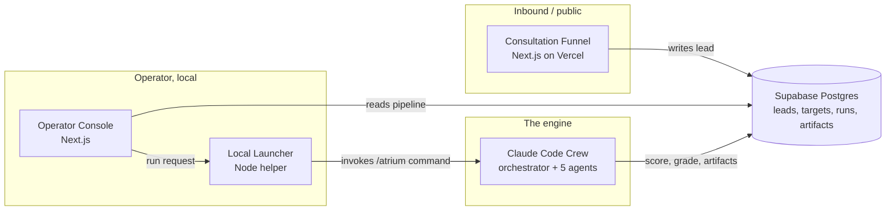

# Atrium

A solo operator sales console for the AltoLumo business. One console runs
both inbound and outbound lead generation over an AI sales crew running
inside Claude Code.

## The business problem

A solo operator faces a structural limit: lead generation and lead work are
each a full-time job, and there is only one person to do both. Inbound
interest must be captured and qualified quickly; outbound prospecting demands
hours of company research and contact discovery per account. Existing tools
don't close the gap — CRMs store records without generating leads, prospecting
databases sell contacts without qualifying fit, and scheduling tools capture a
meeting while contributing nothing about the person on the other side.

## The outcome

Atrium wraps a proven Claude Code sales crew
([ai-sales-team-claude](https://github.com/zubair-trabzada/ai-sales-team-claude))
in an operator console, joins it to an inbound consultation funnel, and
persists everything to one shared database. The operator turns a list of
target companies into scored, contact-mapped, outreach-ready prospects
without manual research, sees inbound and outbound leads in a single
pipeline, and triggers any part of the crew from the console rather than the
command line.

## Architecture



Four layers over one engine: the funnel and console read and write Supabase,
the console calls the launcher, the launcher drives the crew, and the crew
writes its results back to Supabase for the console to render. Supabase
remains the single source of truth; the crew keeps its file-based, auditable,
re-runnable workspace state.

## Scoring engine

A weighted composite, zero to one hundred, across five reference categories:

| Category | Weight |
|---|---|
| Company Fit | 25% |
| Contact Access | 20% |
| Opportunity Quality (BANT + MEDDIC) | 20% |
| Competitive Position | 15% |
| Outreach Readiness | 20% |

Grade bands: A+ (90-100), A (75-89), B (60-74), C (40-59), D (0-39).

## Screenshots

Phase 1 has not shipped a running UI yet. Until then, see the interactive
Phase 0 system model at
[`docs/mockup/atrium-v8-model.html`](docs/mockup/atrium-v8-model.html) — it
demonstrates the architecture, the Lead Engine's sourcing pipeline and
admission gate, the four ICP profiles, the pipeline board, a simulated
prospect run, the review-before-send queue, the inbound funnel, and the
scoring legend, all against mock data.

## Technologies used

Next.js 15 (App Router, TypeScript strict), React 19, Tailwind CSS 3,
Supabase Postgres, Cal.com, Resend, a Node 22 local launcher, and a Claude
Code crew (Python: reportlab, beautifulsoup4, requests). A separate Lead
Engine (Python: requests, pyyaml, pytest) sources, enriches, and verifies
leads against Google Places, Serper, Hunter, and ZeroBounce. Package
management is pnpm for JavaScript and pip for the crew and engine scripts.

## Project structure

```
atrium/
  web/             inbound consultation funnel (Vercel)
  console/         operator console (local)
  launcher/        Node helper bridging the console to Claude Code
  packages/shared/ TypeScript shared between web and console (Supabase client, elicitation engine)
  crew/            orchestrator, skills, agents, scripts, templates, config
  engine/          Lead Engine — sourcing, enrichment, verification (Python)
  docs/            PRD and supporting decks
```

See `CLAUDE.md` for the full development standards and `docs/Atrium-PRD-v5.docx`
for the complete product specification.

## Status

**Phase 1 (Local MVP Crew): complete.** The orchestrator, 13 sub-skills,
and 5 agents are adapted from the reference crew (real content, not stubs)
and verified end-to-end — `/atrium prospect` and `/atrium qualify` both
produce real composite scores from `crew/config/qualify.config.json`'s
weights against real companies.

**Phase 2 (Lead Engine + Shared Pipeline): complete.** `engine/` runs the
full six-stage pipeline — source, enrich, verify, dedup, score, admit —
behind swappable provider interfaces (Google Places, Serper, Hunter,
ZeroBounce), with 70 passing unit tests. `supabase/schema.sql` defines the
shared tables, and `crew/scripts/push_status.mjs`/`fetch_leads.mjs` bridge
the crew to Supabase for real (15 more tests). The console now has a real
pipeline board, lead detail view, deliverability checker (SPF/DKIM/DMARC),
and ICP profile switcher, all backed by a shared `packages/shared/`
workspace package instead of a cross-app relative import.

**Phase 3 (Autopilot, Signals, Review-Before-Send): in progress.** The
Lead Engine now runs a seventh pipeline stage — signals — pulling hiring,
Meta Ad Library, and Google Ads Transparency intent signals into the
first-pass fit score with configurable per-signal weights
(`engine/config/signals.yaml`), 90 passing unit tests.

`docs/Atrium-System-PRD-v8.docx` consolidates and supersedes v5, adding the
Lead Engine, an MCP automation layer, a review-before-send queue, and
configurable multi-profile ICP targeting. See [`ROADMAP.md`](ROADMAP.md)
for the current five-phase, sprint-by-sprint build plan (6 of 14 sprints
done).
