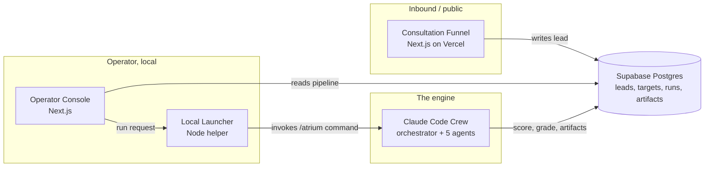

# Atrium

A solo operator sales console for the AltoLumo business. One console runs
both inbound and outbound lead generation over an AI sales crew running
inside Claude Code.

## The business problem

A solo operator faces a structural limit: lead generation and lead work are
each a full-time job, and there is only one person to do both. Inbound
interest must be captured and qualified quickly; outbound prospecting demands
hours of company research and contact discovery per account. Existing tools
don't close the gap — CRMs store records without generating leads, prospecting
databases sell contacts without qualifying fit, and scheduling tools capture a
meeting while contributing nothing about the person on the other side.

## The outcome

Atrium wraps a proven Claude Code sales crew
([ai-sales-team-claude](https://github.com/zubair-trabzada/ai-sales-team-claude))
in an operator console, joins it to an inbound consultation funnel, and
persists everything to one shared database. The operator turns a list of
target companies into scored, contact-mapped, outreach-ready prospects
without manual research, sees inbound and outbound leads in a single
pipeline, and triggers any part of the crew from the console rather than the
command line.

## Architecture



Four layers over one engine: the funnel and console read and write Supabase,
the console calls the launcher, the launcher drives the crew, and the crew
writes its results back to Supabase for the console to render. Supabase
remains the single source of truth; the crew keeps its file-based, auditable,
re-runnable workspace state.

## Scoring engine

A weighted composite, zero to one hundred, across five reference categories:

| Category | Weight |
|---|---|
| Company Fit | 25% |
| Contact Access | 20% |
| Opportunity Quality (BANT + MEDDIC) | 20% |
| Competitive Position | 15% |
| Outreach Readiness | 20% |

Grade bands: A+ (90-100), A (75-89), B (60-74), C (40-59), D (0-39).

## Screenshots

Phase 1 has not shipped a running UI yet. Until then, see the interactive
system model built during inception — it demonstrates the architecture,
pipeline board, a simulated prospect run, the inbound funnel, and the
scoring legend against mock data.

## Technologies used

Next.js 15 (App Router, TypeScript strict), React 19, Tailwind CSS 3,
Supabase Postgres, Cal.com, Resend, a Node 22 local launcher, and a Claude
Code crew (Python: reportlab, beautifulsoup4, requests). Package management
is pnpm for JavaScript and pip for the crew scripts.

## Project structure

```
atrium/
  web/       inbound consultation funnel (Vercel)
  console/   operator console (local)
  launcher/  Node helper bridging the console to Claude Code
  crew/      orchestrator, skills, agents, scripts, templates, config
  docs/      PRD and supporting decks
```

See `CLAUDE.md` for the full development standards and `docs/Atrium-PRD-v5.docx`
for the complete product specification.

## Status

Inception. Repository scaffolded per the PRD's Section 7 project structure.
Phase 1 (Foundation) build has not started.
